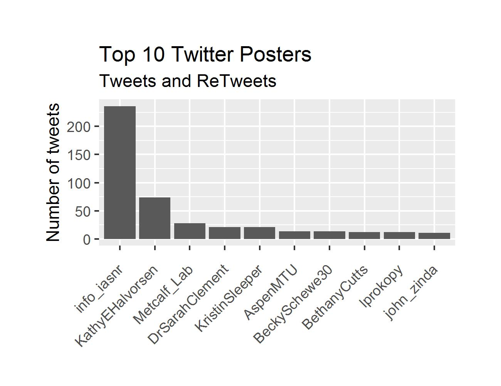
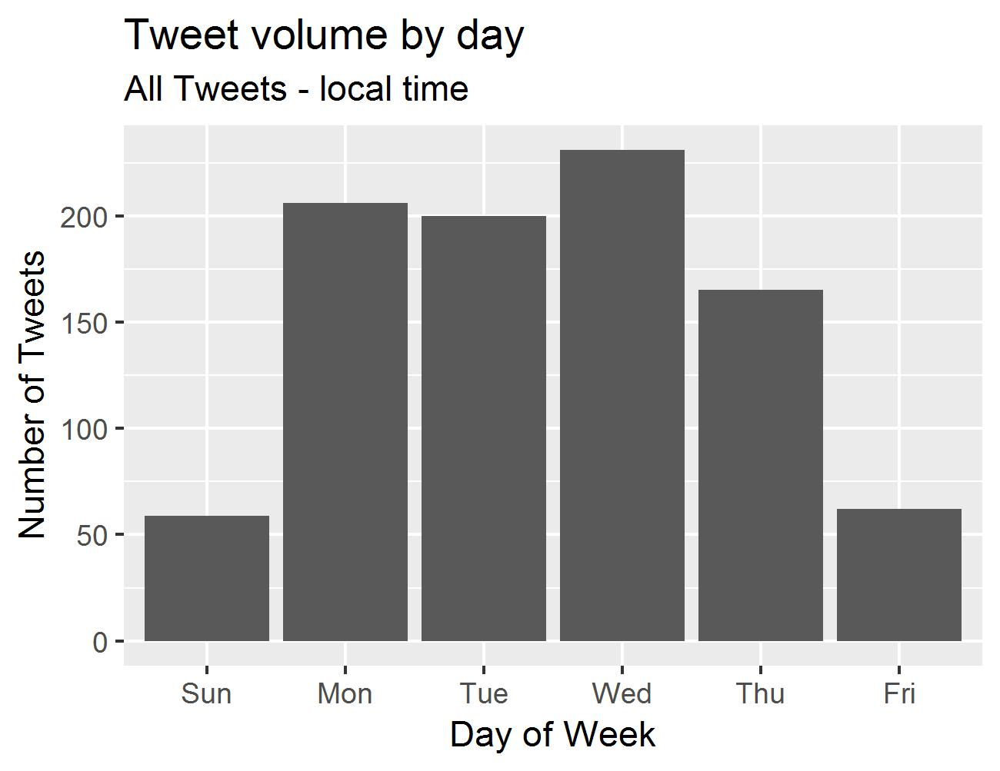
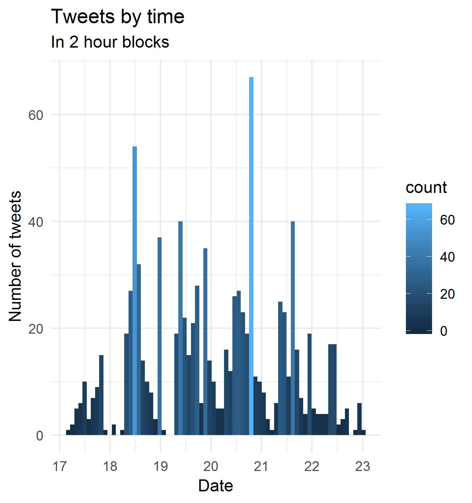

---
authors:
- admin
date: "2018-07-07"
diagram: true
math: true
subtitle: 'Analysis of conference twitter for ISSRM2018'
summary: Analysis of conference twitter for ISSRM2018.
tags:
- Social media
title: Conference twitter at ISSRM2018
---

I attended the International Symposium on Society and Resource Management (ISSRM) in Snowbird, Utah. It was a great conference in a great location!

To look at one aspect of the event I collected tweets that used the conference hashtag - #ISSRM2018. Here's what I found.

## Tweet Frequency

The conference ran from June 17 through 22. During the conference 930 tweets were collected using the hashtag **#ISSRM2018**

Some tweets were retweets and some were original material.

The breakdown was:

  396 original tweets (43%)

  534 retweets (57%)

The most retweeted tweet was:

*"RT @GeogJulie: Excited to launch our new book The Human Dimensions of Forest & Tree Health at the #ISSRM2018 today! @THAPBI @TreeHealthNews @CCRI_UK" https://twitter.com/GeogJulie/status/1009185468397674497*

The most retweeted user was *@KathyEHalvorsen*.

The top 10 tweeters:

## Tweet Time

The day that people tweeted.

and the time.

### Hastags in use
      Hashtag          # of occurances
     1 #issrm2018         397
     2 #humandimensions    14
     3 #scicomm             8
     4 #issrm2019           7
     5 #utah                7
     6 #resilience          6
     7 #socialscience       6
     8 #academicmama        5
     9 #conservation        5
    10 #consocsci           5

### Mentions
        Mentioned       # of mentions
     1 @info_iasnr        120
     2 @mtu_socialsci      27
     3 @mturesearch        23
     4 @kathyehalvorsen    13
     5 @metcalf_lab        12
     6 @umcfc               9
     7 @energy_subject      7
     8 @libbymetcalf        7
     9 @nalininadkarni      7
    10 @snowbird            7
