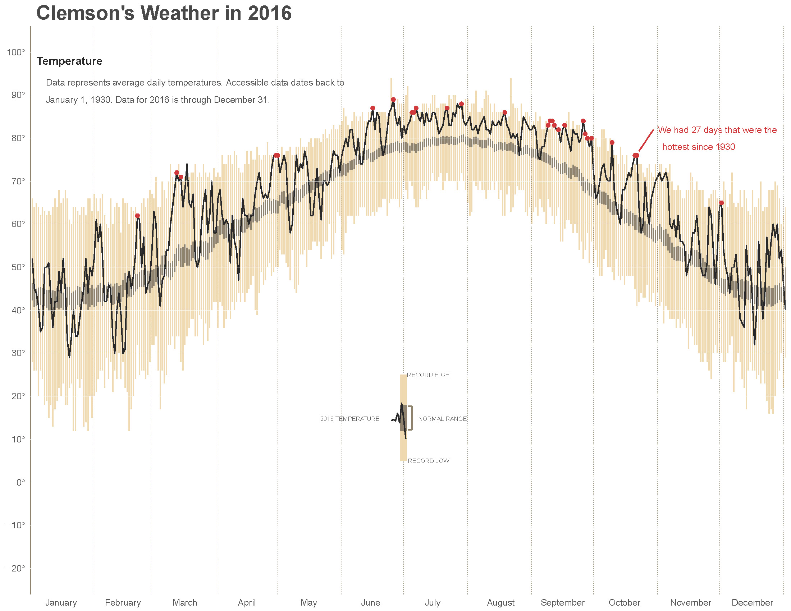

---
authors:
- admin
date: "2017-01-31"
diagram: true
math: true
subtitle: 'Creating a graph of climate like Tufte'
summary: Creating a graph of climate like Tufte too.
tags:
- R
title: Climate Plot for Clemson in R
---

# Climate Plot for Clemson in R

Recently I ran across a tutorial that sought to recreate Edward Tufte's climate plot for Dayton, OH. It was by Brad Boehmke and can be found [here](https://rpubs.com/bradleyboehmke/weather_graphic).

As I am always looking for a way to build up my R skills, I decided to try Brad's script for my local weather station. The Clemson area weather station is at a small airport, and it seems that they have data back to 1930 (nice!). I was able to figure out the [weatherunderground](weatherunderground.com) API and return csv output.

On inspection there are a few years missing in the 1990's, but with a 85 year timespan I ended up with 30122 records.

After tweaking things I was able to produce the plot found here. This shows how 2016 average daily temperatures compare to the previous records back to 1930.

The script can be found at my other github account - [Climate Script](https://github.com/ogletrees/ClimateStudy). Have a go with your local weather station! A pdf of the plot can be found [here](Clemson-2016.pdf)

#### Some notes
- Once things are set up the plotting seems quite slow, maxing out the processor. There probably are ways to speed it up, it seemed quicker the first time I played with it.
- It would probably be easier to annotate in another programs, like Illustrator or Inkscape. Working with Cartesian coordinates involves trial and error.
- Update: Nov 2017 Looks like weatherunderground changed their website, so now something like this would take alot more work - oh well...
